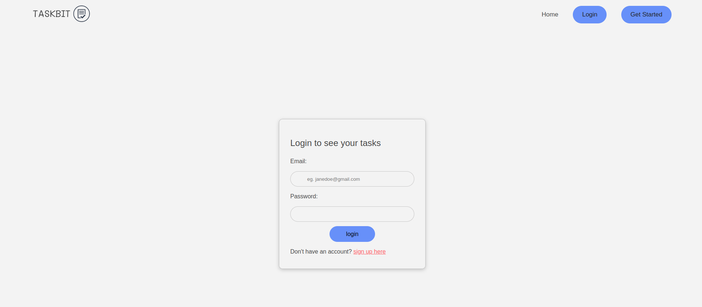

# TASKBIT

This is a simple task manager web application that aims to assist users in effectively managing their tasks. It enables users to conveniently create, prioritize, and monitor their tasks all in one central location.

## Built With

This application has been built with the following tools:


- **React `18.2.+`**
- **Ruby `v2.7.+`**
- **SQlite3 `v1.6`**
- **ActiveRecord `v7.0.4`**
- **Rake `v13.0.6`**
- **Puma `v6.1`**
- **Rails `v7.0.4`**

## Application Features

- User Authentification - A user can signup using their name, email and password, they can also login using their email and password.
- A user can see all their tasks.
- A user can create, update and delete their tasks.

## Installation

To run `TASKBIT` in development, you must install:

- **Ruby version 2.7.0**
- **Rails version 6.0.3.4 or later**
- **Node.js version 12.0.0 or later**
- **SQLite version 3.24.0 or later**

1. Clone the Repository:

   ```
   git clone https://github.com/sainamercy/TaskManager.git

   ```

2. Open terminal and navigate to the api directory:

   ```
      cd ./api
   ```

3. Install API Dependencies

   ```
       bundle install
       rails db:migrate
       rails db:seed
   ```

4. Start rails server

   ```
        rails s
   ```

5. Open a new terminal and navigate to the client directory:

   ```
      cd ./client
   ```

6. Install React dependencies

   ```
       npm install
   ```

7. Start React client to open in browser

   ```
     npm run dev
   ```

To run it in production

- deployment link :

  ```
   https://taskbit-sigma.vercel.app/todos- front end

   https://taskbit-byx7.onrender.com - backend

  ```

## Using the Application

1. Sign up or log in to the application to view all your tasks.
2. Add tasks to your tasks lists by clicking on the `Add task` button on the tasks page.
3. View tasks details by clicking on the arrow icon on the task item.
4. Update and delete tasks by clicking on the respective icons provided on the task item.

- Test user data.

  ```

    email: user@mail.com
    password: password

  ```

- This user has precreated tasks that can be used to test updating, deleting and creating new tasks.

## Screenshots

- Hero Page
  
  <br />

- Login
  
  <br />

- Tasks page
  
  <br />

## Contributing

This project was contributed to by:

[sainamercy](https://github.com/sainamercy)

## License

MIT License

Copyright (c) 2023 sainamercy

Permission is hereby granted, free of charge, to any person obtaining a copy
of this software and associated documentation files (the "Software"), to deal
in the Software without restriction, including without limitation the rights
to use, copy, modify, merge, publish, distribute, sublicense, and/or sell
copies of the Software, and to permit persons to whom the Software is
furnished to do so, subject to the following conditions:

The above copyright notice and this permission notice shall be included in all
copies or substantial portions of the Software.

THE SOFTWARE IS PROVIDED "AS IS", WITHOUT WARRANTY OF ANY KIND, EXPRESS OR
IMPLIED, INCLUDING BUT NOT LIMITED TO THE WARRANTIES OF MERCHANTABILITY,
FITNESS FOR A PARTICULAR PURPOSE AND NONINFRINGEMENT. IN NO EVENT SHALL THE
AUTHORS OR COPYRIGHT HOLDERS BE LIABLE FOR ANY CLAIM, DAMAGES OR OTHER
LIABILITY, WHETHER IN AN ACTION OF CONTRACT, TORT OR OTHERWISE, ARISING FROM,
OUT OF OR IN CONNECTION WITH THE SOFTWARE OR THE USE OR OTHER DEALINGS IN THE
SOFTWARE.
